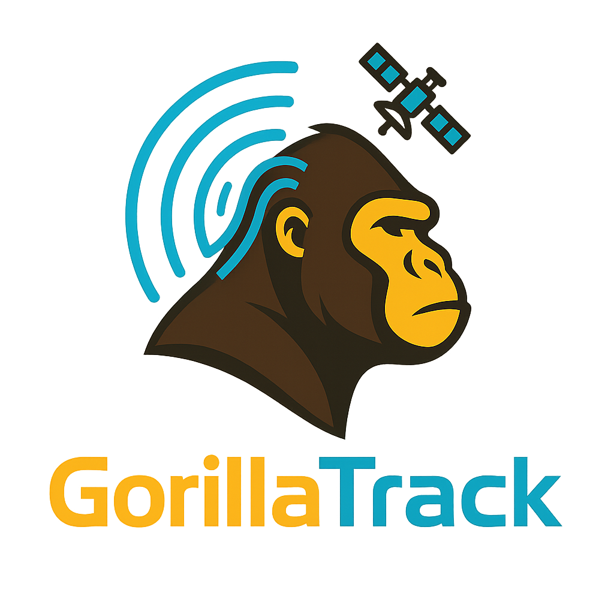

# GorilaTrack 🦍📡

**GorilaTrack** es un sistema de rastreo GPS y comunicación de emergencia diseñado para ofrecer seguridad, confiabilidad y eficiencia energética en situaciones críticas. El dispositivo utiliza un ESP32 conectado a un módulo GPS NEO-6M, un módulo GSM SIM800L, y un sistema de comunicación LoRa SX1276. Integra funcionalidades como envío de SMS con ubicación, llamadas de emergencia, interacción vía Bluetooth y modificación de datos desde una página web accesible sin reprogramar el dispositivo.

<p align="center">
                                   
</p>

---

## 🧠 Características principales

- 📍 Obtención de ubicación en tiempo real mediante GPS.
- 📲 Envío automático de SMS con enlace de Google Maps.
- 📞 Llamadas de emergencia con hasta 3 intentos si no contestan.
- 🔋 Gestión energética optimizada (Deep Sleep, encendido manual).
- 🧠 Configuración remota por Bluetooth mediante página web.
- 💾 Uso de LittleFS para guardar datos como números telefónicos y mensajes.
- 📡 Comunicación LoRa entre múltiples puntos (Puntos Rosa y nodo central).
- 🔧 Totalmente portátil y adaptable a diversas condiciones de operación.

---

## 🔧 Hardware requerido

| Componente            | Modelo/Descripción                       |
|----------------------|-------------------------------------------|
| Microcontrolador     | ESP32-WROOM V3.1 |
| GPS                  | Módulo NEO-6M                            |
| GSM                  | Módulo SIM800L                           |
| Comunicación         | Módulo LoRa SX1276                       |
| Almacenamiento       | SPI Flash (integrado en el ESP32)        |
| Botones físicos      | Para encendido y emergencia              |
| LEDs indicadores     | LED_DATA, LED_GSM, LED_PWR                       |
| Conversores de voltaje | SM5308, MP1584 |
| Batería              | LiPo 3.7V (dos en paralelo)        |

---

## 📁 Estructura del proyecto

```
GorilaTrack/
│
├── Arduino/
│   ├── main.ino                   # Código principal
│   ├── config.h                   # Pines, configuraciones
│   ├── funciones_sms.h            # Envío de SMS
│   ├── funciones_llamada.h        # Gestión de llamadas
│   ├── funciones_gps.h            # Lectura de GPS
│   ├── funciones_lora.h           # Comunicación LoRa
│   └── funciones_ble.h            # Interfaz BLE y web
│
├── data/
│   └── user_data.txt              # Datos cargados por el usuario
│
├── web/
│   └── index.html                 # Página web para editar datos vía BLE
│
└── README.md                      # Este archivo
```

---

## ⚙️ Instalación

1. **Requisitos:**
   - Arduino IDE 2.x
   - Modulos del ESP32 instaladas.
   - Librerías necesarias:
     - `TinyGSM`
     - `TinyGPS++`
     - `LoRa`
     - `FS` / `LittleFS`
     - `BLEDevice`, `BLEServer`
     - `Bounce2`
     - `WebServer`

2. **Pasos:**
   - Carga el contenido de `Arduino` al ESP32.
   - Usa el gestor de archivos de Arduino para subir `Innovatek-GT.ino` con LittleFS.
   - Si deseas editar los datos del usuario vía Bluetooth, accede al sitio web generado por el ESP32 cuando esté en modo BLE.

---

## 📱 Configuración vía Bluetooth

- El ESP32 emite una señal BLE detectable por el navegador cuando se presiona el boton Encendido.
- Desde la web integrada puedes:
  - Cambiar nombre del usuario.
  - Editar número personal y familiar.
  - Modificar el mensaje de emergencia.
  - Activar o desactivar modo de llamada.
- Al guardar los cambios, el ESP32 actualiza su configuración en tiempo real.

---

## 🔐 Seguridad

- Se utilizan botones físicos para evitar activaciones accidentales.
- El ESP32 entra en modo Deep Sleep tras ciertos eventos para preservar batería.
- El botón de encendido debe mantenerse presionado por un tiempo determinado para activar el dispositivo.

---

## 🧭 Modo GorilaTrack (Nodo central)

El nodo central del sistema se comporta como receptor de señales LoRa desde múltiples Puntos Rosa. Al recibir datos de múltiples nodos, selecciona el más cercano (según coordenadas GPS) y envía su ubicación al número personal del usuario vía SMS, sin intervenir al contacto de emergencia.

---

## 🚧 Roadmap y mejoras futuras

- 🌐 Versión web más interactiva y con interfaz moderna.
- 📡 Soporte para múltiples modos de rastreo (en tiempo real, histórico).
- 🔒 Autenticación básica para la interfaz BLE.
- 🛰️ Transmisión por satélite en zonas sin cobertura GSM.
- 🔋 Optimización extrema para autonomía de meses.

---

## 🧪 Créditos

Este proyecto fue desarrollado pensando en la seguridad personal y la tecnología accesible.  
Gracias por usar GorilaTrack.
